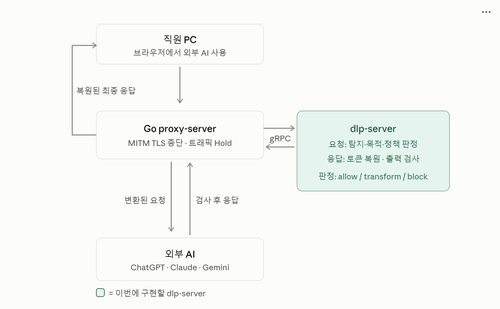

# 🛡️ LLM Data Loss Prevention(DLP) for Enterprise 🛡️

기업용 LLM 사용을 위한 AI 기반 **Data Loss Prevention(DLP) 시스템**입니다.

Go 프록시 서버에서 LLM 트래픽을 가로채고, Python AI 백엔드에서 멀티턴 문맥 기반 PII 탐지 및 마스킹을 수행합니다. 검증이 완료된 요청만 외부 LLM으로 전달하여 민감정보 유출을 사전에 방지합니다.

