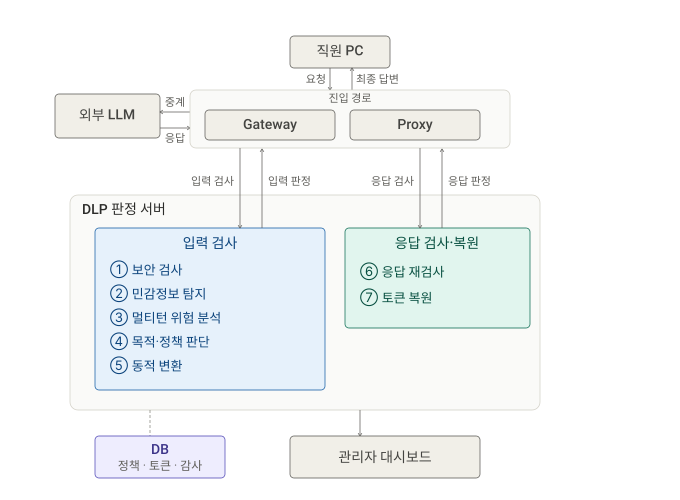

---

# 🛡️ LLM Data Loss Prevention(DLP) for Enterprise 🛡️
기업용 LLM 사용을 위한 AI 기반 **Data Loss Prevention(DLP) 시스템**입니다.

### 💡 Core Idea

Go 프록시 서버에서 LLM 트래픽을 가로채고, FastAPi 기반 백엔드에서 멀티턴 문맥 기반 PII 탐지 및 마스킹을 수행합니다. 검증이 완료된 요청만 외부 LLM으로 전달하여 민감정보 유출을 사전에 방지합니다.

### 🔗 Github Links
1. [DLP Proxy Server](https://github.com/GenAI-DLP/dlp-proxy-server)
2. [Main DLP Server](https://github.com/GenAI-DLP/dlp-server)
3. [Gateway](https://github.com/GenAI-DLP/gateway)
4. [Dashboard](https://github.com/GenAI-DLP/dashboard)

### 📝 Documents
- [Docs](https://github.com/GenAI-DLP/docs)
- 위 repo에는 architecture 및 구현 세부 사항과 관련된 md파일들이 정리되어 있습니다.

---
# 🛠️ Architecture

---
# 🎨 Flowchart

  

